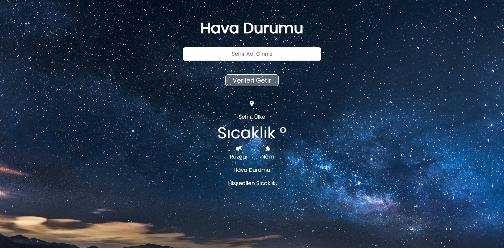
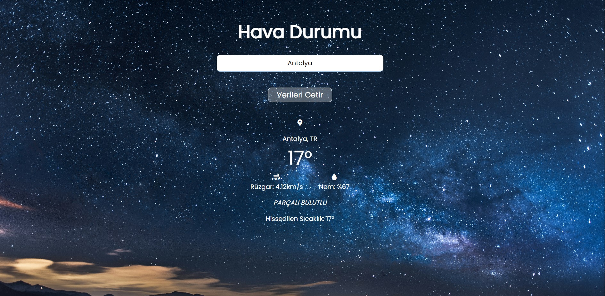

# Weather-web
<h1> Hava Durumu Web Sitesi</h1>

Hava durumu web sitesi örneği.

<h1> Harici Kullanımlar </h1>

Bu proje, kullanıcıların hava durumunu sorgulayabileceği basit bir web sitesi oluşturmayı amaçlamaktadır. API'ler aracılığıyla gerçek zamanlı hava durumu verilerini çeker ve kullanıcıya sunar.
HTML CSS ile görsel arayüz sağlandı. 
Javascript ile dinamik bir tasarım sağlandı

<h1> EKRAN GÖRÜNÜMÜ</h1>

